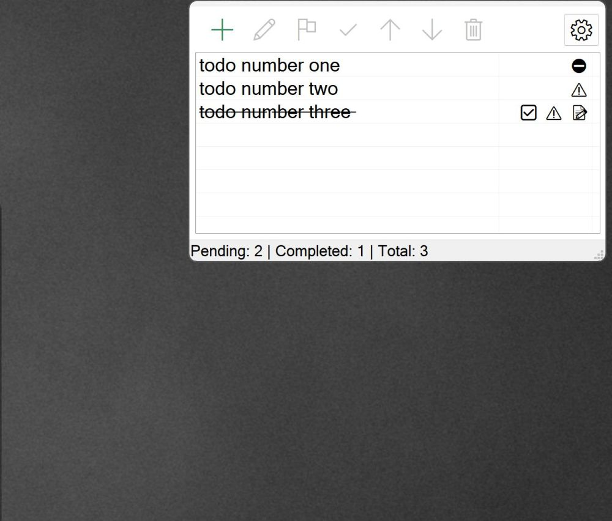

# TodoManager (AutoHotkey v2)

TodoManager is a lightweight, always-available todo list for Windows that lives on the desktop. It stays visible only when the desktop is active, offering quick capture and management without getting in the way of your work.

## Features

- Clean UI: Borderless, draggable, resizable window positioned at the top-right by default.
- Desktop-aware: Automatically shows only when the Windows desktop is active; hides when another window is focused.
- Dimming: Window is dimmed by default to stay subtle; undims on focus/hover. Dim percentage is configurable.
- ListView: Grid with columns for an indicator, title, priority, and reminder text. Nothing is selected by default.
- Toolbar: Icon-only actions using Segoe MDL2 Assets — Add, Edit, Priority (Default/High/Critical), Complete, Move Up/Down, Delete, and Settings.
- Status bar: Live counts of Pending, Completed, and Total items.
- Editing: Double-click a todo to edit.
- Priorities: Default, High, and Critical (visual indicator).
- Complete: Marks a todo with strike-through and moves it to the bottom.
- Persistence: Saves and restores window position/size, font size, dim percentage, and todos across runs (JSON storage).
- Edge snapping: Gentle snapping to monitor work area edges while moving.
- ESC to hide: Press Escape to quickly hide the window.

## How It Works

- Shows only on the desktop by polling active window state and filtering for desktop shell classes.
- Dimming is applied via window transparency; undim on hover/focus and reapply when focus leaves the window.
- Window placement restores to saved geometry if valid; otherwise it initializes to a sensible top‑right position on the preferred monitor.

## Storage & Logs

- Data file: `TodoManager.json` (created in the script folder)
  - Contains `config` (font size, dim percentage, window geometry) and `todos`.
- Logs (in repo/script folder):
  - `errors.log`: Created only when errors occur; exceptions and failures are appended here.
  - `debug.log`: The script includes a `LogDebug` function stub, but debug calls are currently removed; this file is typically not created.

## Requirements

- Windows 10/11
- AutoHotkey v2 (64-bit recommended)

## Run

Download EXE or run script directly:

From a terminal or Run dialog, start the script with AutoHotkey v2:

```
"C:\Program Files\AutoHotkey\v2\AutoHotkey64.exe" TodoManager.ahk
```

The app will appear when the desktop is active. Use the toolbar to add/edit/complete/move items, and open Settings.

## Project Layout

- `TodoManager.ahk` — Main application script (AHK v2).
- `JSON.ahk` — JSON helper library used for persistence.
- `TodoManager.json` — Saved state (auto-created).
- `errors.log`, `debug.log` — Logs (created as needed).

## Notes

- No admin privileges are required.
- All file I/O is defensive; corrupted or missing JSON will be handled gracefully with defaults.
- The UI uses Segoe MDL2 Assets for toolbar icons; ensure this standard Windows font is available (it is on modern Windows).